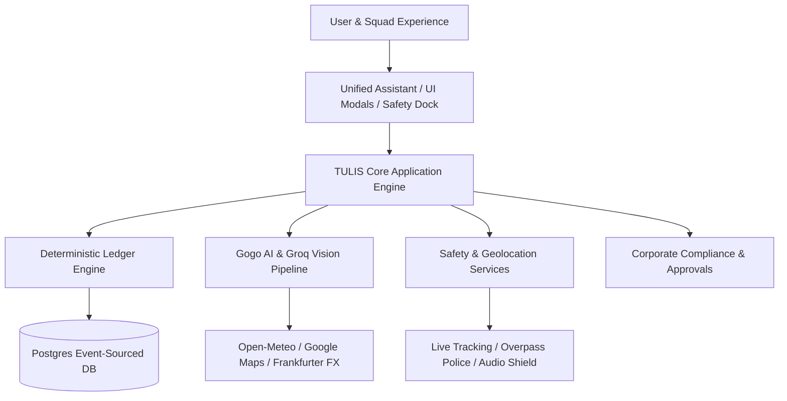
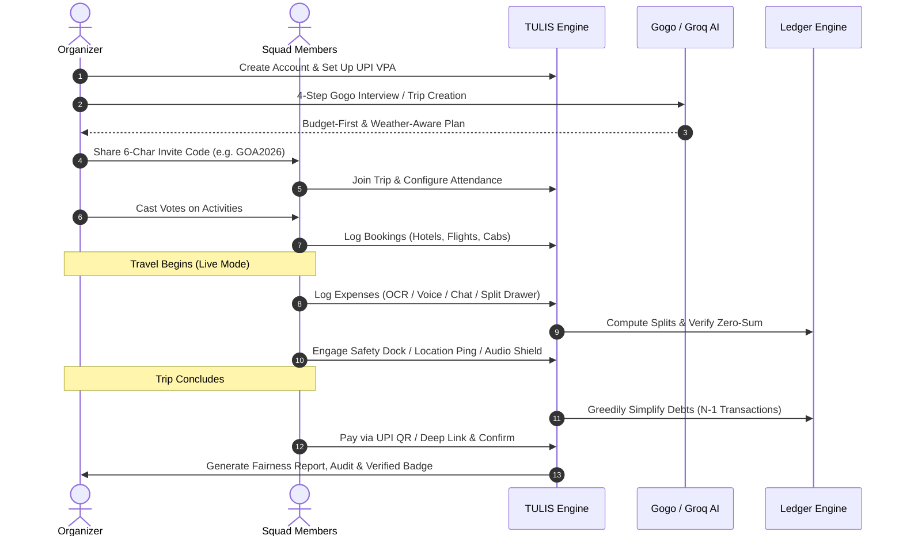
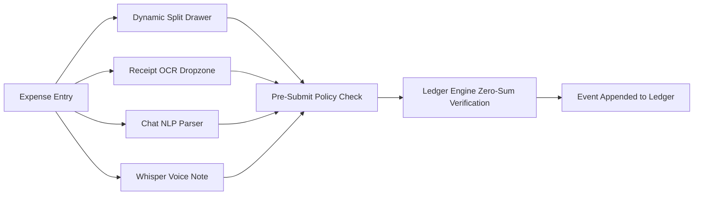
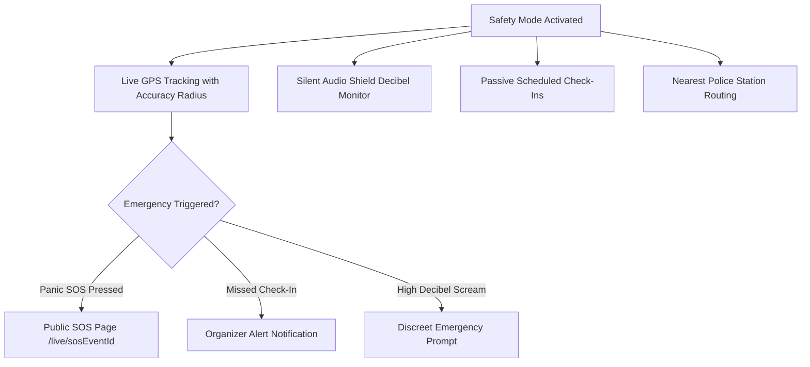
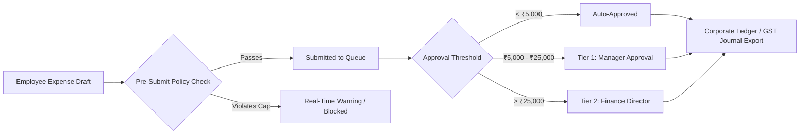

# TULIS — Master User Guide & Instruction Manual
### The Zero-Drift Autonomous Group Travel & Enterprise Financial Operating System

> **TULIS** (Indonesian for *"write / record"*) is a high-precision, event-sourced financial operating system and intelligent travel platform designed for friend squads, group organizers, and enterprise corporate travel desks.
> 
> It pairs a **zero-drift, penny-exact deterministic mathematical ledger** with a **comprehensive travel logistics suite**, autonomous **AI assistants (Gogo)**, an **active human safety shield**, and an **enterprise compliance layer**.

---

## Table of Contents

1. [Executive Overview & System Architecture](#1-executive-overview--system-architecture)
2. [The Core Tenets: "The TULIS Law"](#2-the-core-tenets-the-tulis-law)
3. [The Complete End-to-End User Journey](#3-the-complete-end-to-end-user-journey)
   - [Phase 1: Account Creation & Profile Setup](#phase-1-account-creation--profile-setup)
   - [Phase 2: Trip Inception & AI Itinerary Generation](#phase-2-trip-inception--ai-itinerary-generation)
   - [Phase 3: Squad Invitation, Rostering & Delegation](#phase-3-squad-invitation-rostering--delegation)
   - [Phase 4: Consensus Voting & Itinerary Finalization](#phase-4-consensus-voting--itinerary-finalization)
   - [Phase 5: Booking, Vendor Intelligence & Logistics](#phase-5-booking-vendor-intelligence--logistics)
   - [Phase 6: Live Travel & Multi-Modal Expense Logging](#phase-6-live-travel--multi-modal-expense-logging)
   - [Phase 7: Active Safety Shield & Emergency Protocol](#phase-7-active-safety-shield--emergency-protocol)
   - [Phase 8: Real-Time Intelligence & Collaboration](#phase-8-real-time-intelligence--collaboration)
   - [Phase 9: Settlements, Debt Netting & UPI Transfers](#phase-9-settlements-debt-netting--upi-transfers)
   - [Phase 10: Trip Closeout, Verification & Auditing](#phase-10-trip-closeout-verification--auditing)
4. [Deep-Dive Feature Manual by Pillar](#4-deep-dive-feature-manual-by-pillar)
   - [Pillar 1: Trip Planning & Itinerary Engineering](#pillar-1-trip-planning--itinerary-engineering)
   - [Pillar 2: Organizer Command Center & Governance](#pillar-2-organizer-command-center--governance)
   - [Pillar 3: Bookings, Vendors & Logistics Operations](#pillar-3-bookings-vendors--logistics-operations)
   - [Pillar 4: Financial Ledger Engine & Analytics](#pillar-4-financial-ledger-engine--analytics)
   - [Pillar 5: Safety Shield, SOS & Duty of Care](#pillar-5-safety-shield-sos--duty-of-care)
   - [Pillar 6: Artificial Intelligence & Autonomous Automation](#pillar-6-artificial-intelligence--autonomous-automation)
   - [Enterprise & Corporate Travel Suite](#enterprise--corporate-travel-suite)
   - [Moonshot Innovations (TULIS 1000x)](#moonshot-innovations-tulis-1000x)
5. [Headless Ledger API Developer Guide (`/api/v1/ledger`)](#5-headless-ledger-api-developer-guide)
6. [Offline Mode & Synchronization Architecture](#6-offline-mode--synchronization-architecture)
7. [Troubleshooting & Frequently Asked Questions](#7-troubleshooting--frequently-asked-questions)

---

## 1. Executive Overview & System Architecture

Modern group travel consistently breaks down at the intersection of **human coordination, financial trust, and physical safety**. Traditional apps either handle simple equal expense splits (like Splitwise), itinerary static notes (like Notion or Google Docs), or corporate travel booking (like Concur), leaving gaps where math drifts, receipts get lost, and organizers bear unfair burdens.

TULIS solves this with an integrated 3-tier architecture:



### Key Capabilities at a Glance:
- **Zero-Sum Ledger**: 6 deterministic split algorithms with cent-exact rounding difference absorption.
- **Event-Sourced Immutability**: 35+ append-only ledger events powering instant time-travel auditing.
- **Gogo Conversational Planner**: 4-step interview generating budget-constrained, weather-aware itineraries.
- **Trip DNA & Marketplace**: Clone past trip skeletons or fork community-verified travel templates.
- **Active Safety Dock**: Live GPS location with precision radius circles, silent decibel monitoring (Audio Shield), passive check-ins, nearest police station routing, and a public emergency tracking page.
- **Corporate Portal**: Department cost centers, 2-tier approval workflows, pre-submit policy violation blocking, and duty-of-care safety oversight.
- **Headless API**: Stateless `/api/v1/ledger` REST endpoint for external enterprise ERPs and third-party bots.

---

## 2. The Core Tenets: "The TULIS Law"

Every feature in TULIS obeys four non-negotiable principles:

### Rule 1: The Zero-Sum Financial Invariant
At every millisecond of a trip's existence, the sum of all participant net balances must equal zero:
$$\sum_{i=1}^{N} \text{NetBalance}_i \equiv 0.00$$
Balances are **never stored as mutable numbers in a database**. They are calculated dynamically by replaying the immutable event ledger. When fractional cents occur in weighted splits, the remainder is automatically absorbed by the trip organizer or the expense payer.

### Rule 2: AI Suggests, The Ledger Decides
Artificial Intelligence (Groq, LLaMA, Whisper, OpenCV OCR) is treated as a high-speed drafting and parsing assistant. AI **never writes directly to financial balances**. It creates structured proposals that must pass mathematical validation and human review.

### Rule 3: Event-Sourced Traceability ("Explain Any Number")
No number in TULIS is a mystery. Every balance, settlement recommendation, budget variance, and anomaly connects to specific timestamped events. Tapping "Why?" on any figure displays the cryptographic calculation lineage.

### Rule 4: Privacy & Safety Transparency
Safety tracking, geolocation sharing, and Audio Shield monitoring are **strictly opt-in**. The system never tracks a user secretly. When safety mode is engaged, accuracy radius circles honestly reflect GPS precision, preventing false confidence.

---

## 3. The Complete End-to-End User Journey

Here is the chronological journey of organizing, executing, and settling a group journey on TULIS from start to finish.



---

### Phase 1: Account Creation & Profile Setup

1. **Accessing TULIS**:
   - Open the web application. You will be greeted by the liquid-motion Landing Page featuring the 3D interactive destination globe, live feature cards, and instant access buttons.
2. **Authentication Options**:
   - **Email & OTP**: Enter your email address. TULIS dispatches a secure 6-digit verification code via Resend transactional email (valid for 15 minutes).
   - **Google 1-Tap OAuth**: Click "Continue with Google" for instant zero-friction sign-in.
   - **Corporate SSO**: For enterprise users, click "Corporate Portal" to sign in using your company email domain and cost-center routing.
   - **Demo Sandbox Mode**: For quick evaluation, open the **Account Switcher** to jump instantly between pre-configured personas:
     - *Alex Chen* (Organizer / Squad Lead)
     - *Maya Patel* (Food & Culture Lead)
     - *Sam Rivera* (Logistics & Transport)
     - *Priya Sharma* (Budget Conscious)
     - *Elena Rostova* (Corporate Travel Manager)
3. **Profile & UPI Configuration**:
   - Navigate to your profile avatar in the header.
   - Enter your **UPI ID (VPA)** (e.g., `alex@okaxis` or `maya@okhdfcbank`).
   - *(Optional)* Upload your static UPI QR code image or bank VPA QR. This will be automatically rendered to your squad mates when it is time to settle debts.

---

### Phase 2: Trip Inception & AI Itinerary Generation

Organizers have four flexible paths to initiate a trip:

#### Path A: The Gogo AI 4-Step Conversational Interview
1. Click the **Floating Action Button (FAB)** with the sparkle icon or select **"Plan with Gogo"**.
2. Complete the 4 interactive questions:
   - **Destination**: City, region, or vibe (e.g., *"North Goa beaches & cafes"*, *"Kyoto cultural trail"*).
   - **Dates & Duration**: Departure and return dates.
   - **Squad Size & Composition**: Number of adults, travel style (Relaxed, High Energy, Luxury, Backpacker).
   - **Total Budget Ceiling**: Hard financial cap (e.g., ₹75,000).
3. **Budget-First Backward Planning**:
   - Gogo generates a complete multi-day itinerary. If the initial draft exceeds your budget ceiling, Gogo **automatically downgrades room tiers and swaps premium activities** until the total matches your budget, generating an explicit trade-off audit log.
4. **Weather-Aware Checking**:
   - Gogo queries the Open-Meteo weather forecast for your destination and dates. If rain or adverse conditions are predicted on an outdoor activity day, Gogo flags an alert and offers 1-click indoor alternatives.

#### Path B: Manual Trip Creation
1. Tap **"Create Trip"** on the header or dashboard.
2. Fill in the trip title, destination, base currency (`INR`, `USD`, `EUR`, `GBP`), start/end dates, and optional category budgets (Lodging, Food, Transport, Activities).
3. TULIS automatically generates a unique **6-Character Invite Code** (e.g., `GOA2026`).

#### Path C: Trip DNA (Clone Past Trip)
1. Open **"My Trips"** or **"Trip Switcher"**.
2. Select a past successful trip and click **"Use as Template (Trip DNA)"**.
3. Review the itinerary skeleton: booking titles, categories, duration, and day offsets are copied over. Personal expenses, payments, and private member data are **strictly omitted**.
4. Set new trip dates and commit the new clone.

#### Path D: Universal Itinerary Importer
1. Open the **Universal Itinerary Importer Modal**.
2. Paste raw text from confirmation emails, flight PNRs, booking PDFs, or travel agent WhatsApp messages.
3. The integrated Groq NLP engine extracts hotel check-ins, flight numbers, departure times, and costs, mapping them directly into structured booking drafts.

---

### Phase 3: Squad Invitation, Rostering & Delegation

1. **Inviting Friends**:
   - Click the **"Share Trip"** button in the dashboard header.
   - Copy the 6-character trip code, share the direct deep link (`https://tulis.app/?join=GOA2026`), or have friends scan the on-screen QR code on mobile.
   - When a member enters the code, they are instantly added to the trip roster.
2. **Capability-Scoped Delegation**:
   - Traditionally, organizers have all power or no power. TULIS introduces granular capability delegation:
     - Open the **Squad & Settlements** tab.
     - Click **"Permissions / Capabilities"** next to any participant.
     - Toggle individual permissions:
       - `can_edit_bookings`: Add/modify hotel or activity reservations.
       - `can_approve_refunds`: Process vendor cancellations and allocate credits.
       - `can_manage_roster`: Invite or remove participants.
       - `can_remove_participants`: Remove inactive squad members.
3. **Partial-Attendance Calendar**:
   - Not everyone stays for the full duration. Open the **Attendance Calendar**.
   - Check or uncheck individual dates for each member.
   - When lodging or daily expenses are logged, TULIS **automatically excludes absent members** from those days' split calculations.

---

### Phase 4: Consensus Voting & Itinerary Finalization

1. Before turning a Gogo AI itinerary draft into a live trip, the organizer can toggle **"Enable Squad Voting"**.
2. Joined members see the **Gogo Plan Preview** with interactive vote buttons on every proposed activity:
   - **Thumbs Up** (Must do!)
   - **Thumbs Sideways** (Neutral)
   - **Thumbs Down** (Skip / Replace)
3. Contested activities (>50% downvotes) are highlighted for the organizer with 1-click alternative spot suggestions from TULIS's destination registry.
4. Once finalized, click **"Convert to Live Trip"**. Bookings are materialized in the database, and the ledger is initialized.

---

### Phase 5: Booking, Vendor Intelligence & Logistics

1. **Adding & Importing Bookings**:
   - Use the **Bulk Booking Wizard** to batch-create lodging, transport, flights, and activities.
   - Upload confirmation PDFs or screenshots to the **Receipt & Booking Dropzone**. The OCR engine extracts confirmation codes, vendor names, and price tiers.
2. **Room Tier Optimizer**:
   - For shared villas and apartments with unequal rooms (e.g., Master Suite with Jacuzzi vs. Standard Room vs. Bunk Bed), open the **Room Optimizer Modal**.
   - The engine distributes room costs equitably based on square footage, private bathrooms, and balcony amenities, calculating fair differential payments.
3. **Vendor Reliability Memory**:
   - When selecting a vendor (e.g., cab provider, boutique villa, boat rental), TULIS checks cross-trip historical signals:
     - Price stability (actual cost vs. estimated quote).
     - Refund turnaround time (days taken to credit cancellations).
4. **Cancellations & Auto-Rebooking**:
   - If plans change, open the **Cancel Booking Modal**.
   - TULIS applies the vendor's refund policy (Full, Tiered, or Non-Refundable), logs the pending credit, updates the ledger, and **immediately recommends 2–3 open alternative venues** nearby.

---

### Phase 6: Live Travel & Multi-Modal Expense Logging

During the trip, participants log expenses in real time through 4 frictionless modalities:



#### 1. Dynamic Split Drawer
- Open by tapping **"+ Add Expense"**.
- Select payer, amount, date, category, and choose from **6 split methods**:
  1. **Equal**: Divided evenly among all selected participants.
  2. **Weighted**: Divided by customizable ratios (e.g., couples counting as 2x, children as 0.5x).
  3. **Line Item / Itemized**: Each participant selects their exact consumed dishes, drinks, or tickets.
  4. **Room Tier**: Automatically split according to configured room sizes.
  5. **Organizer Subsidy**: The organizer or company covers a fixed percentage (e.g., 30%), and the remainder is split among participants.
  6. **Manual Shares**: Exact currency amounts entered per person with real-time discrepancy validation.

#### 2. Drag-and-Drop Receipt OCR
- Drop any receipt photo or invoice into the dropzone.
- The multi-stage pipeline (OpenCV image preprocessing $\rightarrow$ Tesseract text recognition $\rightarrow$ Groq vision fallback) extracts merchant name, date, tax, items, and total amount.
- Review extracted line items in the **Receipt Extraction Review Modal** and approve with 1 click.

#### 3. Conversational Chat Expense Logging
- In the **Trip Chat**, simply type naturally:
  > *"Alex paid 3200 for seafood dinner split with Maya and Sam"*
- TULIS's NLP parser extracts amount (`3200`), category (`food`), payer (`Alex`), and split members (`Maya`, `Sam`), displaying a confirmation card.

#### 4. Voice Expense Logging (Whisper)
- Hold the microphone icon in the chat or expense modal.
- Speak in English, Hindi, or mixed conversational dialects. The audio is transcribed via Whisper and converted into a structured expense.

#### Multi-Currency & Locked FX Provenance
- If traveling internationally, log expenses in the local foreign currency (e.g., `USD`, `THB`, `EUR`, `AED`).
- TULIS automatically queries the live Frankfurter FX exchange rate, converts to the trip's base currency, and **permanently locks the exact exchange rate snapshot in the event payload**. Subsequent market fluctuations will never retroactively distort historical debts.

---

### Phase 7: Active Safety Shield & Emergency Protocol

TULIS includes a comprehensive human safety system designed for group travel in unfamiliar environments:



1. **Safety Mode Onboarding**:
   - Participants opt in individually. Grant location permissions and configure emergency contacts (phone numbers and emails).
2. **Live Location & Accuracy Radius**:
   - The **Safety Dock** displays a live map of the squad. Each participant's pin includes a real-time **accuracy radius circle** matching GPS precision in meters, ensuring coordinators know the exact degree of location confidence.
3. **Silent Audio Shield**:
   - When traversing late-night or unfamiliar areas, activate the **Audio Shield**.
   - Runs client-side in the browser: monitors ambient acoustic energy and decibel spikes (detecting screams, impacts, or glass breaks) **without recording or transmitting raw voice audio**. In the event of sustained acoustic distress, it prompts a discreet 10-second check-in countdown before alerting the organizer.
4. **Panic SOS Beacon & Public Live Page**:
   - Pressing the **Emergency SOS button** sounds an audible or silent beacon.
   - An immutable SOS event is logged in the database.
   - An instant public tracking link is generated: `https://tulis.app/live/[sosEventId]`.
   - Emergency contacts and squad members receive the link via SMS/WhatsApp, showing live location, battery level, accuracy radius, and nearest emergency hospitals.
5. **Nearest Police Station Finder**:
   - Queries OpenStreetMap Overpass servers to locate the 3 closest police stations and emergency rooms relative to current coordinates, with 1-tap Google Maps walking/driving directions and local emergency phone numbers.
6. **Passive Check-In Schedules**:
   - For solo excursions, set a check-in timer (e.g., *"Prompt me in 2 hours"*).
   - If the participant fails to tap "I am Safe" within a 15-minute grace period, a gentle alert is dispatched to the organizer.
7. **Buddy Pairing**:
   - When a subset of members splits off for a side adventure, TULIS prompts them to designate a squad buddy who receives status updates.

---

### Phase 8: Real-Time Intelligence & Collaboration

1. **Unified AI Companion FAB**:
   - A single, persistent intelligent assistant follows the squad throughout the trip.
   - Ask planning questions, balance queries, logistics routing, or dispute questions in natural language.
2. **Trip Chat & Co-Pilot Announcements**:
   - Integrated group chat with emoji reactions and file attachments.
   - Organizers can click **"Draft Announcement"**: AI inspects current trip state (unsettled balances, upcoming bookings, pending RSVPs) and composes a friendly broadcast for 1-click review and send.
3. **Anomaly Feed & AI Triage**:
   - TULIS continuously runs 5 statistical anomaly checks:
     - Unusually large expenses (>3x category average).
     - Duplicate charge detection (same vendor, amount, and day).
     - Roster mismatches (members paying for activities on dates they are marked absent).
     - Budget category burn rate warnings.
     - Split drift warnings.
   - The **Anomaly Triage Assistant** groups related anomalies and suggests the optimal sequence to resolve them.
4. **Predictive Budget Variance**:
   - The **Predictive Variance Card** tracks current spend against time elapsed.
   - It calculates linear burn rate:
     $$\text{Projected Final Spend} = \text{Spend to Date} + \left( \frac{\text{Spend to Date}}{\text{Days Elapsed}} \times \text{Days Remaining} \right)$$
   - It warns organizers days in advance if the trip is mathematically projected to breach the ceiling.
5. **Natural Language What-If Simulator**:
   - Before making a financial change, test it risk-free in the **What-If Simulator**.
   - Type in plain English: *"What if Sam leaves 2 days early and we upgrade the villa by ₹8,000?"*
   - Groq translates this into structured parameters and runs a dry-run calculation showing the exact net balance impact on every member **without altering the live ledger**.

---

### Phase 9: Settlements, Debt Netting & UPI Transfers

When the trip ends or at mid-trip milestones, it is time to settle balances:

```mermaid
graph TD
    A[Raw Bilateral Debts: N*(N-1)/2 transactions] --> B[Greedy Debt Simplification Engine]
    B --> C[Minimal N-1 Settlement Transfers]
    C --> D[Pool Mode or Direct UPI Settlement]
    D --> E[Scan UPI QR or 1-Tap Deep Link]
    E --> F[Payment Confirmation & Zero-Sum Audit]
```

#### Debt Simplification (The Greedy Transshipment Graph)
In a squad of 8 people, there could be up to 28 confusing cross-debts. TULIS's ledger engine computes net balances and applies a greedy min-cost flow algorithm, reducing the entire matrix to a maximum of **$N - 1$ (7) clean transfers**.

#### Settlement Modalities:
1. **Direct UPI Settle-Up**:
   - Open the **Squad & Settlements** tab or **Settlement Visualizer**.
   - Tap **"Pay Now"** next to any debt card.
   - On mobile, tap to launch your preferred UPI app directly (Google Pay, PhonePe, Paytm, BHIM) with recipient VPA, exact amount, and note pre-filled:
     `upi://pay?pa=maya@okhdfcbank&pn=Maya Patel&am=1840.50&tn=Tulis Settlement Goa Trip`
   - On desktop, an instant scannable UPI QR code is rendered.
2. **Pool Contribution Pre-Funding Mode**:
   - Alternatively, squads can use **Pool Mode**.
   - Members contribute a lump sum into a shared virtual kitty upfront (e.g., ₹5,000 each).
   - Daily expenses draw down from the common pool. At the end of the trip, unused kitty funds are automatically returned in exact proportion to original contributions.
3. **Cross-Trip Squad Debt Netting**:
   - If your squad travels frequently together, enable **Cross-Trip Netting**.
   - If Alex owes Maya ₹1,500 from the Goa trip, but Maya owes Alex ₹2,000 from last month's Manali trip, TULIS nets the balances into a single transfer: Maya pays Alex ₹500.
4. **Debt Reassignment & Nudge Reminders**:
   - If Maya wants Sam to pay Alex on her behalf, she can propose a **Debt Reassignment**.
   - If someone is slow to pay, organizers can tap **"Nudge"** to send a respectful WhatsApp or email reminder with 1-tap payment links.
5. **AI Dispute Mediator**:
   - If a participant disputes a charge, open the **Dispute Mediator**.
   - AI analyzes the event timestamps, attendance logs, and receipt lines, providing an objective, neutral breakdown of both perspectives to facilitate amicable agreement.

---

### Phase 10: Trip Closeout, Verification & Auditing

1. **Reconciliation Audit Verification**:
   - TULIS verifies the zero-sum invariant:
     $$\text{Total Outlays} - \text{Total Consumed} = 0.00$$
   - It computes a cryptographic SHA-256 integrity hash of all ledger events.
2. **Fairness Audit Report**:
   - Generates a plain-language fairness summary showing who organized, who paid upfront, who consumed what, and confirming that no member was disproportionately burdened.
3. **Post-Trip AI Retrospective**:
   - An editorial summary celebrating trip milestones: total kilometers traveled, top restaurant, most active organizer, and funny trivia extracted from trip chat.
4. **Public TULIS Verified Trust Badge**:
   - Trips with 100% clean reconciliation earn a public verification page:
     `https://tulis.app/verified/[tripId]`
   - Embeddable badge iframe for blogs, social posts, or corporate expense reports confirming mathematically certified zero-drift accounting.
5. **Multi-Format Accounting Export**:
   - **RFC-4180 CSV Export**: Standard spreadsheet format for Excel / Google Sheets.
   - **GST-Ready Journal Export**: India GST compliant format with HSN/SAC codes, CGST/SGST breakdowns, and vendor tax IDs.
   - **Corporate ERP CSV**: Formatted for direct ingestion into SAP, Oracle NetSuite, and Concur.
   - **Printable PDF Certificate**: Audit certificate with event signature seal.

---

## 4. Deep-Dive Feature Manual by Pillar

---

### Pillar 1: Trip Planning & Itinerary Engineering

#### 1.1 Gogo Conversational Interview
- **Location**: Top navigation bar ("Plan with Gogo") or Unified Assistant FAB.
- **How it Works**: Gogo conducts a guided 4-step interview assessing destination, dates, travel party size/vibe, and total budget. It queries a curated destination registry enriched with Google Maps places data.
- **Budget-First Constraint Engine**: Unlike standard AI tools that ignore financial limits, Gogo treats budget as a strict bound. If a draft plan exceeds the cap, Gogo applies a priority cascade (room tier $\rightarrow$ optional activities $\rightarrow$ dining tiers) to guarantee feasibility before showing the result.
- **Outputs**: Complete day-by-day plan with morning, afternoon, evening slots, estimated costs, and booking categories.

#### 1.2 Weather-Aware Replanning
- **Location**: Gogo Plan Preview modal & Itinerary Timeline.
- **How it Works**: At itinerary generation time, TULIS queries the Open-Meteo weather API for historical and 16-day forecast meteorological data for destination coordinates.
- **Conflict Handling**: Outdoor activities scheduled during forecasted heavy precipitation (>5mm) or extreme weather are badged with a warning. A 1-click **"Swap Spot"** button replaces the outdoor activity with a top-rated indoor venue (museum, culinary masterclass, cafe) within 2 km.

#### 1.3 Group Consensus Voting
- **Location**: `GogoPlanPreviewModal` $\rightarrow$ "Squad Voting View".
- **How it Works**: Organizers share a preview link before converting a plan into real bookings. Joined participants vote Yes / Maybe / No per item.
- **Resolution**: Activities with unanimous approval are locked. Contested activities (>50% downvotes) trigger an organizer prompt with recommended alternatives.

#### 1.4 Trip DNA (Cloning & Template Marketplace)
- **Location**: "My Trips" modal $\rightarrow$ "Clone Trip" or "Template Gallery".
- **How it Works**: Extracts relative day offsets ($T+0$, $T+1$, $T+2$), duration, venue names, and categories from past trips. Strips all personal PII, monetary payments, and member records.
- **Execution**: Instantiates a fresh trip draft where dates shift relative to the new start date.

---

### Pillar 2: Organizer Command Center & Governance

#### 2.1 Live Trip Health Score
- **Location**: Top bento-card on `OverviewSection.tsx`.
- **How it Works**: A real-time calculated score from 0 to 100 based on 4 live operational pillars:
  1. **Reconciliation Cleanliness (35%)**: Zero discrepancy = 35 pts; any unbalance = 0 pts.
  2. **Anomaly Count (25%)**: 0 open anomalies = 25 pts; deductions per unreviewed anomaly.
  3. **UPI Payment Readiness (20%)**: Percentage of active members with configured UPI IDs.
  4. **Booking Confirmation Rate (20%)**: Percentage of bookings with confirmed status vs. pending.
- **Color Coding**: 90–100 (Deep Forest Green / Healthy), 70–89 (Warm Yellow / Attention Needed), <70 (Muted Red / Action Required).

#### 2.2 Auto-Generated Readiness Checklist
- **Location**: Companion card to Trip Health Score.
- **How it Works**: Dynamically checks database state for uncompleted tasks:
  - Participants without payment methods.
  - Unconfirmed hotel/cab bookings.
  - Pending corporate expense approvals.
  - Open allocation disputes.
- **Direct Navigation**: Every checklist item contains a 1-click button taking the organizer directly to the resolving modal.

#### 2.3 Capability-Scoped Delegation
- **Location**: `SquadAndSettlementsView.tsx` $\rightarrow$ "Permissions".
- **Capabilities**:
  - `can_edit_bookings`: Create, modify, or reschedule reservations.
  - `can_approve_refunds`: Accept vendor refunds and distribute credits.
  - `can_manage_roster`: Add new travelers and manage attendance.
  - `can_remove_participants`: Remove members who drop out.
- **Security**: Server-side validation on every API endpoint verifies caller capabilities before executing modifications.

#### 2.4 Co-Pilot Announcement Drafting
- **Location**: `TripChatPanel.tsx` $\rightarrow$ "Draft Update".
- **How it Works**: Inspects real-time ledger debts, unconfirmed RSVPs, and daily schedules. Uses Groq LLaMA to draft a polite, engaging squad message. The organizer reviews and edits before sending.

#### 2.5 Organizer Succession Protocol
- **Location**: `SquadManagerModal.tsx` $\rightarrow$ "Transfer Ownership".
- **Emergency Safeguard**: If an organizer becomes unresponsive during an active trip, any member with `can_manage_roster` can trigger a succession vote. If >50% of participants approve and the organizer does not contest within 24 hours, organizer capabilities transfer safely.

---

### Pillar 3: Bookings, Vendors & Logistics Operations

#### 3.1 Bulk Booking Wizard
- **Location**: `BulkBookingWizard.tsx` (Plan & Ledger tab).
- **How it Works**: Quick-entry spreadsheet interface allowing organizers to log 10+ hotel, flight, train, and activity bookings in under 2 minutes, specifying vendor, confirmation code, check-in dates, and payment status.

#### 3.2 Room Tier Optimizer
- **Location**: `RoomOptimizerModal.tsx`.
- **How it Works**: Solves the classic villa dilemma where rooms vary drastically in quality.
- **Inputs**: Base villa cost, room specifications (sq footage, en-suite bathroom, ocean view, balcony).
- **Algorithm**: Normalizes amenity weights and calculates the mathematical surcharge or discount for each room, auto-generating the exact differential split.

#### 3.3 Vendor Reliability Memory
- **Location**: Integrated into `AddBookingModal.tsx` and `VendorSummaryModal.tsx`.
- **How it Works**: Tracks vendor performance across trips:
  - Variance between initial estimate and final checkout bill.
  - Refund processing time when bookings are cancelled.
  - Displays advisory badges (e.g., *"Quick Refunder (~3 days)"* or *"Frequent Surcharges (+12%)"*).

#### 3.4 Partial-Attendance Calendar
- **Location**: `SquadAndSettlementsView.tsx` $\rightarrow$ "Attendance Calendar".
- **How it Works**: A date-by-date grid allowing members to mark days they will be away.
- **Ledger Impact**: Daily lodging, cab, and meal expenses automatically filter out absent members from the denominator, ensuring fair allocations.

#### 3.5 Live Squad Logistics Map ("Who's Where")
- **Location**: Plan & Ledger view $\rightarrow$ "Live Squad Map".
- **How it Works**: Non-emergency, opt-in location sharing allowing travelers to coordinate meetups during free exploration time. Operates independently from the emergency SOS infrastructure.

---

### Pillar 4: Financial Ledger Engine & Analytics

#### 4.1 The 6 Deterministic Split Methods

| Split Method | Ideal Use Case | Mathematical Formula / Allocation Rule |
|---|---|---|
| **Equal** | Shared villa, group cab, shared snacks | $\text{Share}_i = \frac{\text{Total}}{N}$, remainder cents absorbed by payer. |
| **Weighted** | Couples, families with kids, consumption tiers | $\text{Share}_i = \text{Total} \times \frac{w_i}{\sum w_k}$. |
| **Line Item** | Restaurant bills with drinks, varied entrees | $\text{Share}_i = \sum \text{Item}_{i} + \left( \text{Tax} + \text{Tip} \right) \times \frac{\sum \text{Item}_i}{\sum \text{All Items}}$. |
| **Room Tier** | Unequal bedrooms in luxury villas | $\text{Share}_i = \text{Base} \times \text{AmenityWeight}_i$. |
| **Organizer Subsidy** | Corporate trips, sponsored group retreats | $\text{Subsidy} = \text{Total} \times S\%$; remainder split among participants. |
| **Manual** | Custom negotiated agreements | User inputs exact values; must sum to total ($\Delta = 0.00$). |

#### 4.2 "Explain Any Number" Universal Traceability
- **Location**: Click the **"Why?"** or info icon next to any financial number in the application.
- **How it Works**: Queries the underlying immutable events table and displays the full audit breakdown:
  - Base formula used.
  - Event IDs and timestamps of contributing expenses and payments.
  - Fractional cent rounding adjustments applied.

#### 4.3 Locked FX Provenance
- **Location**: Automatically engaged whenever logging an expense in a non-base currency.
- **How it Works**: Fetches live exchange rate from Frankfurter API. Captures `exchange_rate`, `fx_source`, and `timestamp` directly inside the immutable event record. Balances never fluctuate due to currency movements after entry.

#### 4.4 Predictive Budget Variance
- **Location**: `PredictiveVarianceCard.tsx` in Overview tab.
- **How it Works**: Projects future spend using linear burn rate modeling. Alerts organizers when projected total spend exceeds budget ceiling, broken down by category (Food, Lodging, Transport).

#### 4.5 Fairness Audit Report
- **Location**: Activity Log tab $\rightarrow$ "Generate Fairness Report".
- **How it Works**: Synthesizes end-of-trip data into a comprehensive narrative:
  - Upfront capital contribution vs. actual consumption.
  - Nights slept vs. lodging paid.
  - Confirms zero-sum fairness across all travelers.

---

### Pillar 5: Safety Shield, SOS & Duty of Care

#### 5.1 Dynamic Accuracy Radius Circle
- **Location**: Active SOS modal, Safety Dock map, and `/live/[sosEventId]`.
- **How it Works**: Browser Geolocation API extracts latitude, longitude, and `accuracy` (in meters). The map renders a translucent precision circle around the pin. A 10m radius indicates high-precision GPS; a 200m radius indicates cell-tower triangulation, preventing false precision.

#### 5.2 Silent Audio Shield Decibel Monitor
- **Location**: Safety Dock $\rightarrow$ "Audio Shield".
- **How it Works**: Web Audio API connects to the device microphone client-side via an `AudioContext` and `AnalyserNode`. Computes RMS decibel levels every 100ms.
- **Zero Privacy Intrusion**: **No audio is recorded, stored, or streamed.** The engine only tracks raw sound energy. If sustained decibel levels exceed 85 dB (screams or collisions), a 10-second check-in countdown initiates.

#### 5.3 Panic SOS & Public Live Tracking Page
- **Location**: Red Emergency SOS button in Safety Dock.
- **Trigger**: Click or hold for 3 seconds.
- **Actions**:
  1. Emits high-priority browser alert.
  2. Dispatches SMS/email to configured emergency contacts.
  3. Activates live public tracking URL: `https://tulis.app/live/[sosEventId]`.
  4. Emergency page updates location pings in real time without requiring login.

#### 5.4 Nearest Police Station & Hospital Routing
- **Location**: `NearestPoliceModal.tsx` in Safety Dock.
- **How it Works**: Makes an Overpass API spatial query for `amenity=police` and `amenity=hospital` within a 15 km bounding box. Returns name, distance, phone number, and 1-tap navigation directions.

#### 5.5 Passive Check-In Schedules
- **Location**: `CheckInSetupModal.tsx`.
- **How it Works**: Users configure safety check-in intervals (e.g., every 3 hours during a solo hike). If a check-in is missed, the organizer is alerted with the user's last known location.

---

### Pillar 6: Artificial Intelligence & Autonomous Automation

#### 6.1 Unified AI Companion ("Gogo, Everywhere")
- **Location**: Persistent Floating Action Button on all screens.
- **Intelligent Routing**: The assistant understands user intent and dynamically routes queries to the appropriate engine:
  - *Planning queries* $\rightarrow$ Destination registry & Gogo engine.
  - *Expense queries* $\rightarrow$ Dynamic Split Drawer & OCR parser.
  - *Financial & balance questions* $\rightarrow$ Ledger engine & "Explain Any Number".
  - *Safety inquiries* $\rightarrow$ Safety dock, nearest police, or SOS trigger.
  - *Disputes* $\rightarrow$ Dispute mediator.

#### 6.2 Anomaly Triage Assistant
- **Location**: `AnomalyFeedBanner.tsx`.
- **How it Works**: When multiple anomalies fire simultaneously, AI analyzes dependencies and presents an prioritized action plan (e.g., *"Fix the incorrect villa date first; doing so resolves 2 downstream split anomalies automatically"*).

#### 6.3 Multi-Engine Receipt OCR Cascade
- **Location**: Drag-and-drop receipt zone.
- **How it Works**:
  1. **OpenCV.js**: Deskews, enhances contrast, and binarizes the receipt image.
  2. **Tesseract.js**: Performs fast local OCR text extraction.
  3. **Groq LLaMA Vision**: If local confidence is <75%, passes the image to Groq for high-accuracy parsing of wrinkled, handwritten, or multilingual receipts.

#### 6.4 Natural-Language What-If Simulator
- **Location**: `WhatIfSimulatorModal.tsx`.
- **How it Works**: Users enter questions in plain text. Groq extracts structured delta actions (`ADD_EXPENSE`, `REMOVE_PARTICIPANT`, `MODIFY_BOOKING`) and passes them to `simulateDryRun()`. The UI previews balance changes without affecting live data.

#### 6.5 Visible Confidence Scoring
- **Rule**: Every AI feature in TULIS visibly displays its confidence level using the standardized `ConfidenceBadge` component:
  - **High (>85%)**: Emerald badge.
  - **Medium (65–85%)**: Warm Amber badge with review recommendation.
  - **Low (<65%)**: Soft Red badge requiring manual user confirmation.

---

### Enterprise & Corporate Travel Suite

For corporate retreats, sales offsites, and business travel:



#### C.1 Corporate Authentication & Cost Centers
- Sign in with corporate credentials to automatically map employees to department cost centers (e.g., `Engineering`, `Marketing`, `Executive`).

#### C.2 Real-Time Pre-Submit Policy Compliance
- **Location**: Dynamic Split Drawer & Chat Expense modal in corporate trips.
- **How it Works**: Validates expense against active policies **while drafting**, before submission. If an employee logs a dinner exceeding the ₹2,500 meal cap, an inline warning displays the policy rule and required justification.

#### C.3 Multi-Level Approval Chains
- **Configurable Tiers**:
  - **Auto-Approval**: Under ₹2,000.
  - **Tier 1 (Manager)**: ₹2,000 to ₹15,000.
  - **Tier 2 (Finance / Travel Desk)**: Above ₹15,000.
- Approvers view receipts, policy notes, and tax breakdowns in the dedicated **Approval Queue Section**.

#### C.4 Central Travel-Desk Portfolio Dashboard
- **Location**: `OrgPortfolioDashboard.tsx`.
- **How it Works**: Displays a macro view across **all company trips**: active travelers, total burn rate vs. budget, pending approvals, and collective safety status.

#### C.5 Real-Time Department Spend View
- Aggregates spend by cost center and expense category in real time with interactive breakdown charts.

#### C.6 Per-Diem Auto-Calculation
- Configures standard daily allowances by destination city tier (Tier 1 Metro, Tier 2, International). Automatically generates daily per-diem vouchers for employees without requiring manual receipt uploads for minor incidentals.

#### C.7 Duty-of-Care Corporate Safety Dashboard
- Corporate travel managers have a real-time safety dashboard showing all travelling employees, active Safety Mode opt-ins, flight status, and emergency SOS alerts.

#### C.8 Document & Visa Expiry Tracker
- Tracks employee passport, visa, and travel insurance validity dates, alerting managers if an employee's documentation expires within 6 months of a planned international trip.

#### C.9 GST-Ready Accounting Export
- Exports full Indian GST compliant journals containing Vendor GSTIN, HSN/SAC codes, reverse charge flags, and CGST/SGST/IGST tax breakdowns ready for direct import into Tally, Zoho Books, or SAP.

---

### Moonshot Innovations (TULIS 1000x)

#### M.1 Pool Contribution Pre-Funding Mode
- **What it is**: Replaces settle-later debts with a shared virtual travel pot.
- **How it Works**: Participants deposit funds into the pool upfront. Expenses marked as `isPoolExpense` draw down the kitty balance. Unused funds are refunded proportionally at trip close:
  $$\text{Refund}_i = \text{RemainingPool} \times \frac{\text{Contribution}_i}{\sum \text{Contributions}}$$

#### M.2 Headless Ledger-as-a-Service API (`/api/v1/ledger`)
- Provides external companies, bots, and travel platforms programmatic access to TULIS's zero-drift settlement engine via REST API (documented in Section 5).

#### M.3 TULIS Verified Trust Badge
- Completed trips with zero-sum mathematical reconciliation receive a public cryptographic badge: `https://tulis.app/verified/[tripId]`.
- Features SHA-256 verification hashes and embeddable badges for complete transparency.

---

## 5. Headless Ledger API Developer Guide

TULIS provides programmatic access to its zero-drift mathematical engine for enterprise travel desks, WhatsApp bots, and third-party travel platforms.

### Base Endpoint
```
POST /api/v1/ledger
GET  /api/v1/ledger (Service Discovery & Health Check)
```

### Authentication
Include one of the following headers:
```http
x-api-key: tulis_live_sk_test
```
or
```http
Authorization: Bearer tulis_live_sk_test
```
*(In development or sandbox mode on localhost, requests are automatically authenticated).*

---

### Action 1: `calculate-splits`
Computes exact penny-accurate allocation shares with automatic rounding difference absorption.

#### Request:
```bash
curl -X POST http://localhost:3000/api/v1/ledger \
  -H "Content-Type: application/json" \
  -H "x-api-key: tulis_live_sk_test" \
  -d '{
    "action": "calculate-splits",
    "amount": 14500,
    "splitMethod": "weighted",
    "participants": [
      { "id": "p1", "name": "Alex Chen", "weight": 1 },
      { "id": "p2", "name": "Maya Patel", "weight": 1.5 },
      { "id": "p3", "name": "Sam Rivera", "weight": 0.8 }
    ]
  }'
```

#### Response:
```json
{
  "success": true,
  "action": "calculate-splits",
  "data": {
    "totalAmount": 14500,
    "splitMethod": "weighted",
    "shares": {
      "p1": 4393.94,
      "p2": 6590.91,
      "p3": 3515.15
    },
    "zeroDriftVerified": true,
    "roundingDiscrepancy": 0
  }
}
```

---

### Action 2: `simplify-debts`
Reduces an arbitrary $N \times N$ debt matrix down to the mathematically minimal set of bilateral UPI transfers ($N-1$).

#### Request:
```bash
curl -X POST http://localhost:3000/api/v1/ledger \
  -H "Content-Type: application/json" \
  -H "x-api-key: tulis_live_sk_test" \
  -d '{
    "action": "simplify-debts",
    "netBalances": [
      { "participant": { "id": "p1", "name": "Alex Chen", "upiId": "alex@upi" }, "netBalance": 4200 },
      { "participant": { "id": "p2", "name": "Maya Patel", "upiId": "maya@upi" }, "netBalance": -1800 },
      { "participant": { "id": "p3", "name": "Sam Rivera", "upiId": "sam@upi" }, "netBalance": -2400 }
    ]
  }'
```

#### Response:
```json
{
  "success": true,
  "action": "simplify-debts",
  "data": {
    "transfers": [
      {
        "from": { "id": "p2", "name": "Maya Patel", "upiId": "maya@upi" },
        "to": { "id": "p1", "name": "Alex Chen", "upiId": "alex@upi" },
        "amount": 1800,
        "upiDeepLink": "upi://pay?pa=alex@upi&pn=Alex%20Chen&am=1800.00&tn=Tulis%20Settlement"
      },
      {
        "from": { "id": "p3", "name": "Sam Rivera", "upiId": "sam@upi" },
        "to": { "id": "p1", "name": "Alex Chen", "upiId": "alex@upi" },
        "amount": 2400,
        "upiDeepLink": "upi://pay?pa=alex@upi&pn=Alex%20Chen&am=2400.00&tn=Tulis%20Settlement"
      }
    ],
    "transactionCount": 2,
    "totalVolumeSettled": 4200
  }
}
```

---

### Action 3: `reconciliation-audit`
Performs an independent mathematical audit of gross outlays against debt allocations and returns cryptographic verification proof.

#### Request:
```bash
curl -X POST http://localhost:3000/api/v1/ledger \
  -H "Content-Type: application/json" \
  -H "x-api-key: tulis_live_sk_test" \
  -d '{
    "action": "reconciliation-audit",
    "participants": [
      { "id": "p1", "name": "Alex Chen", "isOrganizer": true },
      { "id": "p2", "name": "Maya Patel", "isOrganizer": false }
    ],
    "expenses": [
      {
        "id": "e1",
        "tripId": "trip-demo",
        "paidById": "p1",
        "amount": 5000,
        "splitMethod": "equal",
        "allocations": [
          { "participantId": "p1", "amount": 2500 },
          { "participantId": "p2", "amount": 2500 }
        ]
      }
    ],
    "payments": []
  }'
```

#### Response:
```json
{
  "success": true,
  "action": "reconciliation-audit",
  "data": {
    "isReconciled": true,
    "discrepancy": 0,
    "totalExpenses": 5000,
    "totalAllocated": 5000,
    "verificationHash": "e3b0c44298fc1c149afbf4c8996fb92427ae41e4649b934ca495991b7852b855",
    "status": "MATHEMATICALLY_PERFECT_ZERO_SUM"
  }
}
```

---

### Action 4: `export-rfc4180`
Generates RFC-4180 compliant CSV journal data for direct ingestion into corporate ERP systems.

#### Request:
```bash
curl -X POST http://localhost:3000/api/v1/ledger \
  -H "Content-Type: application/json" \
  -H "x-api-key: tulis_live_sk_test" \
  -d '{
    "action": "export-rfc4180",
    "trip": { "id": "trip-1", "title": "Goa Leadership Offsite", "baseCurrency": "INR" },
    "expenses": [...],
    "participants": [...]
  }'
```

---

### Action 5: `pool-state`
Calculates shared kitty state, draw-downs, remaining funds, and proportional refund distributions.

#### Request:
```bash
curl -X POST http://localhost:3000/api/v1/ledger \
  -H "Content-Type: application/json" \
  -H "x-api-key: tulis_live_sk_test" \
  -d '{
    "action": "pool-state",
    "tripId": "trip-demo",
    "contributions": [
      { "id": "c1", "tripId": "trip-demo", "participantId": "p1", "amount": 10000 },
      { "id": "c2", "tripId": "trip-demo", "participantId": "p2", "amount": 10000 }
    ],
    "expenses": [
      { "id": "e1", "tripId": "trip-demo", "paidById": "pool", "amount": 12000, "isPoolExpense": true }
    ]
  }'
```

#### Response:
```json
{
  "success": true,
  "action": "pool-state",
  "data": {
    "totalContributed": 20000,
    "totalSpent": 12000,
    "currentPoolBalance": 8000,
    "refundBreakdown": [
      { "participantId": "p1", "refundAmount": 4000, "sharePercent": 50 },
      { "participantId": "p2", "refundAmount": 4000, "sharePercent": 50 }
    ]
  }
}
```

---

## 6. Offline Mode & Synchronization Architecture

Group travel frequently takes users to remote valleys, islands, and high-altitude locations with intermittent or non-existent connectivity. TULIS handles this with an offline-first event queue:

1. **Local State Queuing**:
   - When offline, expenses, votes, and booking edits are converted into structured `OfflineCommand` payloads and committed to browser `IndexedDB` / `localStorage`.
   - The UI displays an amber **"Offline Queue Active (N Pending)"** indicator in the bottom bar.
2. **Optimistic Local Execution**:
   - The local ledger engine updates balances and views immediately on the device so the user can continue logging expenses without interruption.
3. **Automatic Reconnect Synchronization**:
   - When cellular or Wi-Fi connectivity is restored, the `OfflineQueueIndicator` automatically transmits queued commands in timestamp order to `/api/events`.
   - The server verifies idempotency tokens, updates Neon Postgres, logs reconciliation audits, and notifies the user with a green sync confirmation.

---

## 7. Troubleshooting & Frequently Asked Questions

### Q1: What happens if an expense doesn't split evenly into cents/paise?
**A**: The TULIS ledger engine never truncates or loses fractional pennies. In an equal split of ₹100.00 among 3 people, two members are allocated ₹33.33 and the remaining ₹0.01 is automatically absorbed by the expense payer or trip organizer. The sum of shares **always matches the total outlay exactly to the cent**.

### Q2: Can a member dispute an expense they did not consume?
**A**: Yes. In the **Plan & Ledger** or **Expenses** tab, any participant can tap **"Dispute Allocation"** on an expense card. The charge is flagged with an amber warning, excluded from final settlement simplification, and routed to the **AI Dispute Mediator** for objective reconciliation between the payer and member.

### Q3: What happens if someone arrives 2 days late to a 7-day trip?
**A**: Open the **Attendance Calendar** under Squad & Settlements and uncheck the first two days for that participant. From that moment forward, any hotel or meal expenses logged on those two dates will automatically divide costs only among the members who were actually present.

### Q4: Is my location constantly tracked in Safety Mode?
**A**: No. Location tracking is strictly opt-in and activates only when you explicitly turn on **Safety Mode** or trigger the **Emergency SOS Beacon**. When active, accuracy radius circles accurately represent your GPS signal precision, and you can disable tracking at any time with a single tap.

### Q5: How do I export data for company reimbursement?
**A**: In the **Activity Log** tab, choose your preferred export format:
- **Printable PDF Certificate**: For manual manager submission.
- **GST-Ready CSV**: For Indian corporate finance and tax filing.
- **RFC-4180 CSV**: For automated upload to SAP, NetSuite, or Concur.

### Q6: Can I use TULIS outside of India?
**A**: Yes. TULIS natively supports multi-currency trips with base currencies in `USD`, `EUR`, `GBP`, `AED`, `SGD`, `JPY`, and `INR`. When logging international expenses, live exchange rates are captured via the Frankfurter API and permanently locked into the transaction history.

---

## Conclusion & Architecture Summary

TULIS bridges the gap between chaotic group logistics and rigorous financial precision. Whether coordinating a weekend Goa beach trip among friends or managing a 200-person multi-department international offsite, TULIS guarantees **absolute zero-drift accounting, comprehensive physical safety, and effortless intelligent planning**.
